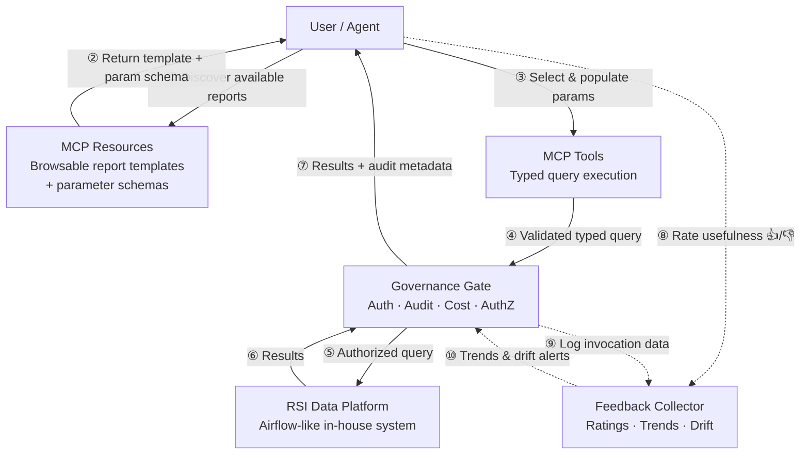

# BJP26110-RIC — Proposal Draft: Proposed Solution (Slides 2–3)

> **Format:** Slide deck. Tone: business-oriented, technical enough to impress. Primary audience: Mr. Yamano (technical champion) with decision-maker visibility.
>
> **Section time budget:** 2 = 5–10 min, 3 = 10–15 min
>
> **Narrative through-line:** *Your RSI MCP is currently scoped as a data pipe. We propose building it as a reference implementation for human-centered MCP design — showing how to connect a complex internal platform while solving the adoption barriers your non-technical users face today.*

---

## Section 2 | AIX Support — Assessment Approach

### Slide 2.1 — Assessment Criteria & Methods

**Headline:** *"We'll evaluate your current AI ecosystem across four dimensions — architecture, security, guardrails, and accountability — with a lens on what it takes for your entire team, not just power users, to get real value from it."*

#### 1. Architecture Review (Design Validity)
| We'll assess | How |
|---|---|
| Tool & MCP schema quality — well-typed vs. brittle | Schema inspection of existing MCPs and skills |
| Observability coverage — can you trace usage, cost, outcomes? | Dashboard data audit + call-graph tracing |
| Drift detection readiness — how would you know if a skill degrades? | Review monitoring patterns and alerting |

*Cross-cut: Are schemas designed for semantic discoverability by non-technical users, or do they assume CLI fluency?*

#### 2. Security Assessment
| We'll assess | How |
|---|---|
| Access boundaries — which MCPs touch which internal systems | Data-flow mapping: each MCP ↔ system it reaches (Tasky, Kintone, etc.) |
| Permission scoping — least-privilege vs. over-permissive endpoints | Auth boundary review per skill/MCP |
| Data exposure surface — what leaves the agent sandbox | Invocation log review |

*Cross-cut: Do security constraints block non-technical workflows unnecessarily, or are they transparent to the user?*

#### 3. Guardrails & Standards for QA
| We'll assess | How |
|---|---|
| Skill-audit gate — what does the publishing pipeline require? | Walkthrough of the existing publishing pipeline |
| Error-handling UX — what happens when a skill fails? | Review of error responses for non-technical readability |
| Output quality gates — E2E tests, edge case coverage | Spot-check E2E skills for test coverage |

*Cross-cut: Do guardrails accommodate non-technical users (helpful recovery, guided fallback) or assume CLI expertise?*

#### 4. Accountability Under Full Automation
| We'll assess | How |
|---|---|
| Human-in-loop architecture — where does a user *review before act*? | Output-review step inventory across skills |
| Trust calibration — does the UX push toward blind faith or healthy skepticism? | Trust-mode analysis (over-trust / reflexive distrust failure modes) |
| Audit trail — can you trace *who approved what, when*? | Approval-flow mapping |

*Cross-cut: Can a non-technical user understand what the agent is about to do before approving it?*

---

### Slide 2.2 — Deliverable & Expected Value

**Headline:** *"You'll walk away with a prioritized blueprint your in-house team can act on — not a report that sits on a shelf."*

| What you'll receive | What it unlocks |
|---|---|
| **Assessment findings** — heat-map across 4 dimensions<br>• Architecture: schema validity, observability, drift readiness<br>• Security: boundary map, permission gaps, exposure surface<br>• Guardrails: audit-gate rigor, error-handling UX, test coverage<br>• Accountability: HIL architecture, trust calibration, audit trail | **Clarity on current state** — know where you stand<br>• Evidence-based view of each dimension<br>• Surface hidden risks before they cause incidents<br>• Baseline to measure improvement against |
| **Prioritized improvement roadmap** — sequenced by impact<br>• Each finding → specific remediation + effort estimate<br>• Dependencies surfaced (guardrails precede automation)<br>• Phased rollout: quick wins → structural changes | **Execution-ready plan** — your team starts immediately<br>• Remove ambiguity: what to fix first, second, third<br>• No wasted work — every step unblocks the next<br>• Manageable cadence for your in-house team |
| **Maturity baseline** — scored benchmark (remeasure 3/6/12mo)<br>• 1–5 rubric per dimension, evidence-based rationale<br>• Cross-referenced against industry patterns<br>• Remeasurement protocol: same criteria, same method | **Trackable progress** — data for leadership<br>• Objective measure of improvement over time<br>• Context: know if ahead or behind peers<br>• Consistent tracking across quarters and years |
| **Adoption-specific recommendations** — for non-technical staff<br>• Schema redesign: MCP Prompts, NL triggers<br>• Output-review UX: structured previews, trust cues<br>• Feedback-loop: per-invocation capture, drift monitoring<br>• Onboarding docs + training needs assessment | **Broader capability** — toolkit → department resource<br>• Non-technical staff self-serve without memorizing commands<br>• Users review before trusting — reduces blind faith & reflexive distrust<br>• Continuous improvement instead of silent degradation<br>• Scale without bottlenecking your technical team |

**The takeaway:** *This isn't a passive review. You'll get an actionable roadmap that bridges where you are today to where you need to be — built around the dimensions that matter most to your team.*

---

## Section 3 | MCP Server — Development Approach

### Slide 3.1 — Requirement & Use Case Analysis

**Headline:** *"Your RSI Data Platform is the most powerful internal system your agents can't reach. We'll change that — starting with what you need today, and shaped for what becomes possible tomorrow."*

**Known requirements (from client):**
- Pull data from RSI Data Platform for recurring reports (sales, regional, operational)
- Non-technical staff (regional planners, sales managers) must request reports without query/SQL knowledge
- The MCP must be authenticated, auditable and feedbacks for governance and future improvement
- Current workflow: manual GUI → export → reformat → deliver (bottlenecked by technical staff)

**Use cases we're addressing:**

| Use Case | Primary actors | Current friction |
|---|---|---|
| UC1 — Weekly regional sales by product line | Regional planners | Must ask technical team to run query |
| UC2 — Ad-hoc data exploration across dimensions | Sales managers, analysts | Cannot self-serve; dependency on power users |
| UC3 — Operational report delivery to Tasky | PMs, AMs | Manual export/import between systems |

**How we address them:**

| Tier | Scope | Commitment |
|---|---|---|
| **Tier 1** | **Core data fetching** — typed MCP Tools for structured RSI queries. Agent discovers tool definitions and converts natural-language prompts to validated query parameters. | **Committed** — core deliverable |
| **Tier 2** | **Adoption layer** — human-reviewable output previews, guided report scaffolding (MCP Prompts), per-invocation feedback capture. | **Proposed** — unlocks broader productivity; makes RSI accessible to staff who can't write queries |
| **Tier 3** | **Advanced** — write-back to RSI (trigger workflows), cross-system orchestration (RSI → Tasky → Kintone), drift detection on output quality. | **Future** — natural extensions once foundation is proven |

**User journey (Tiers 1+2):**
> *"Pull last month's regional sales data by product line"* → Agent discovers relevant Tool definition, maps NL params → Tool validates typed params → *Preview approved report* → One-click confirm → *Results delivered + feedback captured*

---

### Slide 3.2 — Current RSI Data Platform Assessment

**Headline:** *"We've done this before. Here's what we bring — and what we need from you to get the RSI MCP right."*

| What we bring | What we need from you |
|---|---|
| **Deep MCP & agent-tooling expertise** — we design and build MCP servers professionally; this is our core competency, not a side experiment | **Business use cases & reporting patterns** — who needs what data, at what cadence, in what format |
| **Proven architecture patterns** for governed, observable, feedback-enabled agent interfaces — auth, audit, governance gate, feedback collector — designed for production, not prototypes | **Sample report outputs** — a few examples of the reports your team runs today, so we match expected format and data shape |
| **Enterprise AI transformation methodology** — we've structured AI adoption across multiple orgs; governance, harness, observability, and feedback loops are built into our standard approach | **Power user walkthrough** — 30 min screen share of how your team currently interacts with RSI via GUI |
| **Hands-on experience with your ecosystem** — we already understand Claude Code skill marketplaces, cost dashboards, Tasky, and Kintone integration patterns from our assessment groundwork | **RSI documentation / API specs** — post-NDA, for validation and edge case coverage |

**Our commitment:** We start building from day one. Your inputs shape the prototype. Post-NDA access validates it. No delays waiting for full access.

---

### Slide 3.3 — Solution Design

**Headline:** *"Built as a reference architecture — not just an MCP endpoint. Every component chosen to be reproducible by your team across every system you integrate."*

#### Architecture Overview

```
┌──────────────────────────────────────────────────┐
│                   User / Agent                    │
│  (Natural language: "pull Q3 sales by region")    │
└──────┬───────────────────────────────────┬───────┘
       │ ① Discover                       │ ⑧ Rate
       ▼                                   ▼
┌─────────────────┐              ┌──────────────────┐
│  MCP Resources   │              │  Feedback        │
│  Report templates│              │  Collector       │
│  + param schemas │              │  👍/👎/Skip      │
│  (browsable)     │              │  per invocation  │
└────────┬─────────┘              └────────▲─────────┘
         │ ② Select template + params       │
         ▼                                   │
┌─────────────────────────────────────────────┘
│ ③
▼
┌──────────────────────────────────┐
│          MCP Tools               │
│  Typed query tools with params   │
│  (agent auto-maps NL → schema)   │
└──────────────┬───────────────────┘
               │ ④ Validated query
               ▼
┌──────────────────────────────────┐
│         Governance Gate           │
│  Auth enforcement · Audit log     │──⑨ Metadata──▶ Feedback Collector
│  Cost attribution · AuthZ check   │◀──⑩ Trends────
└──────────────┬───────────────────┘
               │ ⑤ Authorized query
               ▼
┌──────────────────────────────────┐
│     RSI Data Platform API Layer   │
│  (Airflow-like in-house platform) │
└──────────────────────────────────┘
```

**Mermaid diagram (flow view):**



**Interaction sequence:**
> ① Agent discovers available reports via MCP Resources → ② User picks a template → ③ Agent maps NL input to typed params → ④ Tool validates and passes to Governance Gate → ⑤ Gate enforces auth, logs audit entry, queries RSI → ⑥ Results return through Gate → ⑦ User sees results + metadata → ⑧ User rates result quality → ⑨ Invocation data logged to Feedback Collector → ⑩ Trends feed back into Governance for drift detection

#### Key Design Principle — Typed Tools with Agent Discovery

> The MCP server exposes **typed query tools** — each tool has a well-defined parameter schema (types, enums, required/optional, constraints). The agent discovers these definitions at runtime and converts natural-language requests into validated structured parameters. The server then validates constraints before executing against RSI.
>
> *This means:* non-technical staff never need to know tool names or parameter formats. The agent handles mapping — and if the request is ambiguous, the agent uses the tool schema to ask clarifying questions automatically.

#### Component Breakdown

| Component | What It Does | Why It Matters |
|---|---|---|
| **MCP Resources** | Browsable catalog of report templates with parameter schemas — agent discovers available reports, gets schema, guides user through param selection | Users don't need to know tool names or param formats — discoverability moves learning from "error phase" to "discovery phase" |
| **MCP Tools** | Typed query tools with validated parameters — agent auto-maps natural-language prompts to structured schemas | No command recall needed; the agent handles translation from NL to structured params |
| **MCP Prompts** | Scaffolded workflows for common patterns (weekly sales, monthly region, ad-hoc drilldown) | Guided experience from first interaction — zero prompt engineering required |
| **Governance Gate** | Auth enforcement · Audit logging · Cost attribution · Permission authorization — every invocation is identity-verified, logged, and permission-checked | Who ran it, what they ran, and whether it was authorized — auditable and governable from day one |
| **Feedback Collector** | Captures ratings (👍/👎/Skip) from users + invocation metadata from Governance Gate. Aggregates trends and detects drift | Closes the feedback loop; enables continuous improvement instead of silent degradation |

#### Design Rationale (why this, not that)

| Decision | Rationale |
|---|---|
| MCP Resources for report templates (not hardcoded in Tools) | Resources are discoverable and browsable — agent can list available report types without executing anything. Parameter schemas live with the template, keeping Tool definitions focused on execution |
| Governance Gate as separate layer | Reusable across future MCPs — one governance standard for all systems, not embedded in each Tool's logic |
| Feedback at invocation level (not session level) | Granular enough to detect skill drift per use case; lightweight enough to not fatigue users |
| Prompts as first-class components (not documentation) | Lowers barrier to entry — structured starting points require zero prompt engineering skill |

---

#### 🗣️ Speaker Notes — MCP Resources & Feedback Collector (how they actually work)

**MCP Resources — operational flow:**

> The RSI MCP exposes a set of **Resources** — think of them as a browsable catalog of report templates.
>
> When a user types *"Show me what reports I can run"*, the agent calls `resources/list` and discovers available template URIs like `rsi://reports/sales-by-region`, `rsi://reports/monthly-attrition`, etc.
>
> The agent then reads the chosen Resource via `resources/read`, which returns its schema: required parameters (date range, region, product line), optional filters, and output format. The agent presents these to the user conversationally — *"I need a date range and region. Which quarter?"*
>
> Once parameters are collected, the agent calls the relevant **MCP Tool** (typed, validated) to execute the actual query against RSI. The Resource handles *discovery and scoping*; the Tool handles *execution*.
>
> **UI benefit:** zero custom UI. It all works through the agent's conversation interface — Claude Code or any MCP client.

**Feedback Collector — operational flow:**

> Feedback flows into the Collector from **two sources**:
>
> **Source 1 — User ratings:** After results are delivered, the agent presents a lightweight prompt: *"Was this report useful? 👍 / 👎 / Skip"*. The user rates directly. This captures perceived quality.
>
> **Source 2 — Governance Gate metadata:** Every invocation automatically logs: caller identity, tool used, parameters, execution time, token cost, output size. This captures operational reality.
>
> Together, these two streams enable:
> - **Drift detection:** A weekly sales report that gets 90% 👍 and drops to 60% over a month triggers an alert — something changed (data quality, schema drift, user expectations)
> - **Usage heatmaps:** Which reports are requested most? By whom? At what cadence?
> - **Value segmentation:** Compare feedback scores across technical vs. non-technical users — are certain tools failing specific segments?
> - **Audit trail completeness:** Every invocation has both the *what happened* (Governance Gate) and *was it good* (user rating)
>
> Trend data flows back to the Governance Gate, which can produce governance dashboards and drift alerts — closing the feedback loop Section 2 identified as missing from their current system.

---

## Appendix: Future Horizons

**Headline:** *"Once the foundation is proven, here's where this approach leads."*

| Capability | Description |
|---|---|
| **Write-back to RSI** | Agents trigger RSI workflows directly — e.g., "Schedule a report refresh for the 1st of every month" |
| **Cross-system orchestration** | Single natural-language request spans RSI + Tasky + Kintone — "Pull last month's data, create a Jira issue with findings, and post the summary to Kintone" |
| **Self-service report scheduling** | Users ask in natural language: "Send me a weekly regional pipeline report every Monday at 9 AM" — agent sets it up, monitors delivery, reports failures |
| **Drift detection** | Feedback Collector data feeds a monitoring layer that alerts when output quality degrades over time — proactive QA, not reactive |
| **MCP template library** | The RSI MCP becomes a reusable template; your team applies the same architecture pattern to every internal system you want to connect |
